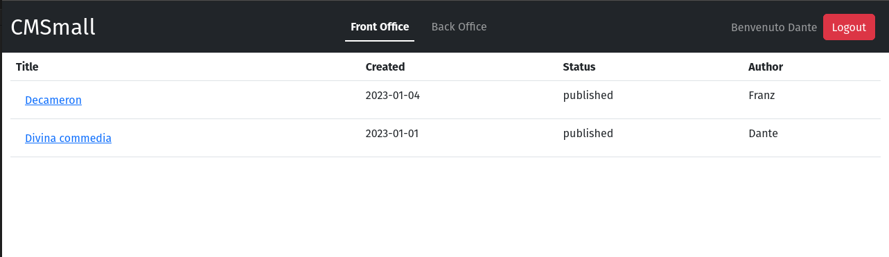
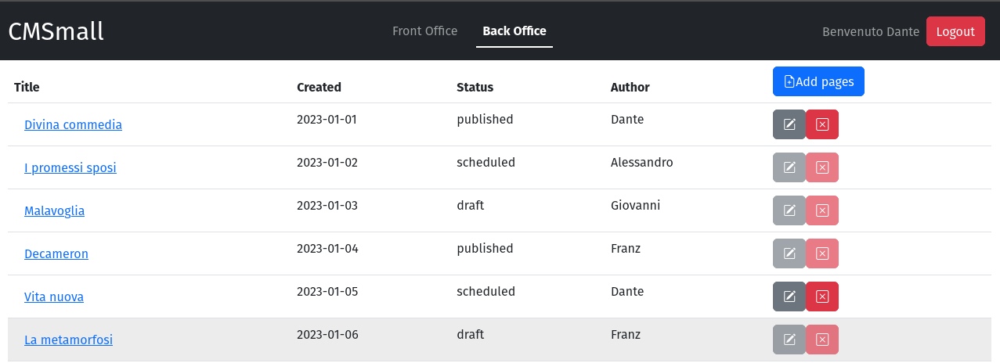
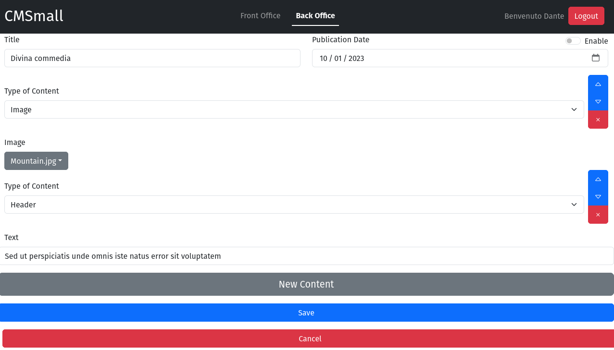

[](https://classroom.github.com/a/suhcjUE-)
# Exam #1: "CMSmall"
## Student: s317856 Discolo Lorenzo 

## __React Client Application Routes__

- Route `/`: nel caso in cui l'utente non è autenticato sarà possibile visualizzare la sola lista delle pagine pubblicate disposte in ordine cronologico per data di pubblicazione. Nel caso in cui sia autenticato come 'user' potrà accedere al "Back Office" dove sono presenti tutte le pagine create. Avrà la possibilità di modificare, creare o eliminare le pagine di cui è autore. Infine, nel caso in cui sia autenticato come 'admin', oltre a poter modificare, creare o eliminare qualsiasi pagina, potrà modificare il nome del sito. Tutti gli utenti hanno la possibiltà di accedere alle proprietà delle singole pagine andando a cliccare il loro titolo.

- Route `/login`: è presente il form di login in modo tale che l'utente possa autenticarsi ed accedere all'applicazione. 

- Route `/add`: Route annidata che permetterà di creare una nuova pagina. Nel caso in cui l'utente è autenticato come 'user' potrà specificare il titolo, la data di pubblicazione(opzionale) e aggiungere un numero indefinito di contenuti pur avendo l'obbligo di doverne creare almeno 2 che siano un header e un contenuto scelto tra un' immagine e un paragrafo. Nel caso in cui l'utente è autenticato come 'admin' avrà la possibilità di poter speficare anche l'autore del documento nella creazione di quest'ultimo.

-Route `/edit/:pageId`: Route annidata che permetterà di modicare una pagina. Nel caso l'utente è autenticato come 'user' potrà modificare solo le pagine di cui è autore secondo le regole specificate nella Route precedente. Nel caso l'utente è autenticato come 'admin' avrà la possibilità di modificare qualsiasi pagina.

-Route `/pages/:pageId`: Route annidata che permetterà a un qualsiasi utente, autenticato o non, di poter visualizzare tutte le proprietà della pagina e i suoi contenuti disposti nell'ordine definito dal creatore o da colui che ha modificato per ultimo la pagina. 

- Route `*`: pagina non trovata.

## API Server

### __Site Name__

URL: `/api/siteName`

Method: GET

Description: Get site name.

Request body: _None_

Response: `200 OK` (success) or `500 Internal Server Error` (generic error).

Response body: site name.
```
  "CMSmall"
```


### __List Pages__

URL: `/api/pages`

Method: GET

Description: Get all the pages.

Request body: _None_

Response: `200 OK` (success) or `500 Internal Server Error` (generic error).

Response body: An array of objects, each describing a page.
```
[{
    "id":1,
    "title":"Divina commedia",
    "createdDate":"2022-12-31",
    "publicationDate":"2023-01-09",
    "author":"Dante",
    "authorId":1
},
...
]
```

### __Get a Page (by Id)__

URL: `/api/pages/:id`

Method: GET

Description: Get the question identified by the id `<id>`.

Request body: _None_

Response: `200 OK` (success), `404 Not Found` (wrong id), or `500 Internal Server Error` (generic error).

Response body: An object, describing a single Page.
```
{
    "id":1,
    "title":"Divina commedia",
    "createdDate":"2022-12-31",
    "publicationDate":"2023-01-09",
    "author":"Dante",
    "authorId":1
}
```

### __Get all Contents to a given Page (By Id)__

URL: `/api/pages/:id/contents`

Method: GET

Description: Get all the contents associated to a given page identified by the id `<id>`.

Request body: _None_

Response: `200 OK` (success), `404 Not Found` (wrong id), `404 Not Found` (Page without Contents) or `500 Internal Server Error` (generic error).

Response body: An array of objects, each describing a Content.
```
[{
    "id":8,
    "type":"header",
    "content":"Sed ut perspiciatis ...",
    "position":0,
    "pageId":4
},
...
]
```
### __Add a New Page with Contents__

URL: `/api/pages`

Method: POST

Description: Add a new page to the list of the pages with all its contents. A cookie with a VALID SESSION ID must be provided. The user adding the page is taken from the session or from request body if admin specified.

Request body: An object representing a page with its contents (Content-Type: `application/json`).
```
{{
  "title":"Prova1",
  "createdDate":"2023-06-25",
  "publicationDate":null,
  "authorId":null,
  "contents":[{
                "id":0,
                "type":"header",
                "content":"prova",
                "position":0
                },..
              ]}}
```

Response: `201 Created` (success) or `503 Service Unavailable` (Database error during the creation of page and its contents.). If the request body is not valid, `422 Unprocessable Entity` (validation error). If the request does not come on an authenticated session, `401 Unauthorized`.

Response body: Message , as a JSON value (Content-Type: `application/json`).
```
Creation success

```
### __Update a Page with its Contents__

URL: `/api/pages/:id`

Method: PUT

Description: Update entirely an existing Page with its contents, identified by its id. A cookie with a VALID SESSION ID must be provided. The user requesting the update the page must be the same that owns the page or from admin.

Request body: An object representing the entire page (Content-Type: `application/json`).
```
{{
  "title":"Prova2",
  "createdDate":"2023-06-25",
  "publicationDate":null,
  "authorId":null,
  "contents":[{
                "id":0,
                "type":"header",
                "content":"prova",
                "position":0
                },..
              ]}}
```

Response: `200 OK` (success) or `503 Service Unavailable` (Database error during the update of page ${req.params.id}). If the request body is not valid, `422 Unprocessable Entity` (validation error). If the request does not come from the author or from admin, `403 Forbidden` ('Must be the author of the page to edit it.') If the request does not come on an authenticated session, `401 Unauthorized`.

Response body: Message , as a JSON value (Content-Type: `application/json`).
```
Update success

```

### __Update site name__

URL: `/api/siteName`

Method: PUT

Description: Update Site Name. A cookie with a VALID SESSION ID must be provided. The user requesting the update the site name must be the admin.

Request body: An object representing the site name (Content-Type: `application/json`).
```
{"nameSite":"CMSmall"}
```

Response: `200 OK` (success) or `503 Service Unavailable` ('Database error during the update of site name'). If the request body is not valid, `422 Unprocessable Entity` (validation error). If the request does not come from the admin, `403 Forbidden` ('Must be the admin to change the name of the site.') If the request does not come on an authenticated session, `401 Unauthorized`.

Response body: Message , as a JSON value (Content-Type: `application/json`).
```
Update success

```

### __Delete a Page__

URL: `/api/pages/:id`

Method: DELETE

Description: Delete an existing page, identified by its id. A cookie with a VALID SESSION ID must be provided. The user requesting the deletion the page must be the same that owns the page or admin.

Request body: _None_

Response: `204 No Content` (success) or `503 Service Unavailable` (Database error during the deletion of page ${req.params.id}.).If the request does not come from the admin,`403 Forbidden` (Must be the author of the page to delete it.) If the request does not come on an authenticated session, `401 Unauthorized`.

Response body: Message , as a JSON value (Content-Type: `application/json`).
```
Delete success

```
### __List of authors__

URL: `/api/authors`

Method: GET

Description: Get all the users.

Request body: _None_

Response: `200 OK` (success) or `500 Internal Server Error` (generic error). If the request does not come from the admin,`403 Forbidden` (Must be the admin to get all authors information.). If the request does not come on an authenticated session, `401 Unauthorized`.

Response body: An array of objects, each describing a page.
```
[{
    "authorId":1,
    "username":"alighieri@test.com",
    "author":"Dante"
},
...
]
```

### __Create a new session (login)__

URL: `/api/sessions`

HTTP Method: POST

Description: Create a new session starting from given credentials.

Request body:
```
{
  "username": "harry@test.com",
  "password": "pwd"
}
```

Response: `200 OK` (success) or `500 Internal Server Error` (generic error).

Response body: _None_

### __Get the current session if existing__

URL: `/api/sessions/current`

HTTP Method: GET

Description: Verify if the given session is still valid and return the info about the logged-in user. A cookie with a VALID SESSION ID must be provided to get the info of the user authenticated in the current session.

Request body: _None_ 

Response: `201 Created` (success) or `401 Unauthorized` (error).

Response body:
```
{
  "username": "kafka@test.com",
  "id": 6,
  "name": "Franz"
}
```

### __Destroy the current session (logout)__

URL: `/api/sessions/current`

HTTP Method: DELETE

Description: Delete the current session. A cookie with a VALID SESSION ID must be provided.

Request body: _None_

Response: `200 OK` (success) or `500 Internal Server Error` (generic error).

Response body: _None_

## Database Tables

- Table `users` - contiene utenti registrati nel sistema, columns: id email hash name role salt available ;
- Table `pages` - contiene le pagine create columns: id title createdDate publicationDate authorId ;
- Table `contents` - contiene i contenuti delle pagine create columns: id type content position pageId ;
- Table `site` - contiene il nome del sito columns id text ;

## Main React Components

- `OfficeRoute` (in `./components/OfficeRoute`): componente che contiene sempre la lista delle pagine nel momento in cui un utente entra nel sito
- `FormRoute`  (in `./components/PageForm'`): componente che contiene il form che permette la modifica e la creazione di una pagina
- `Page` (in `./components/PageRoute`): componente che permette di visualizzare le proprietà della pagina selezionata
- `NavHeader` (in `./Navbar`): Componente che gestiche l'intestazione della pagina e con il quale l'utente autenticato può passare della visione del front Office a quella del Back Office.

## Screenshot





## Users Credentials

| email | password |
|-------|----------|
| alighieri@test.com | polito |
| manzoni@test.com | polito |
| verga@test.com | polito |
| Wilde@test.com | polito |
| kafka@test.com | polito |


